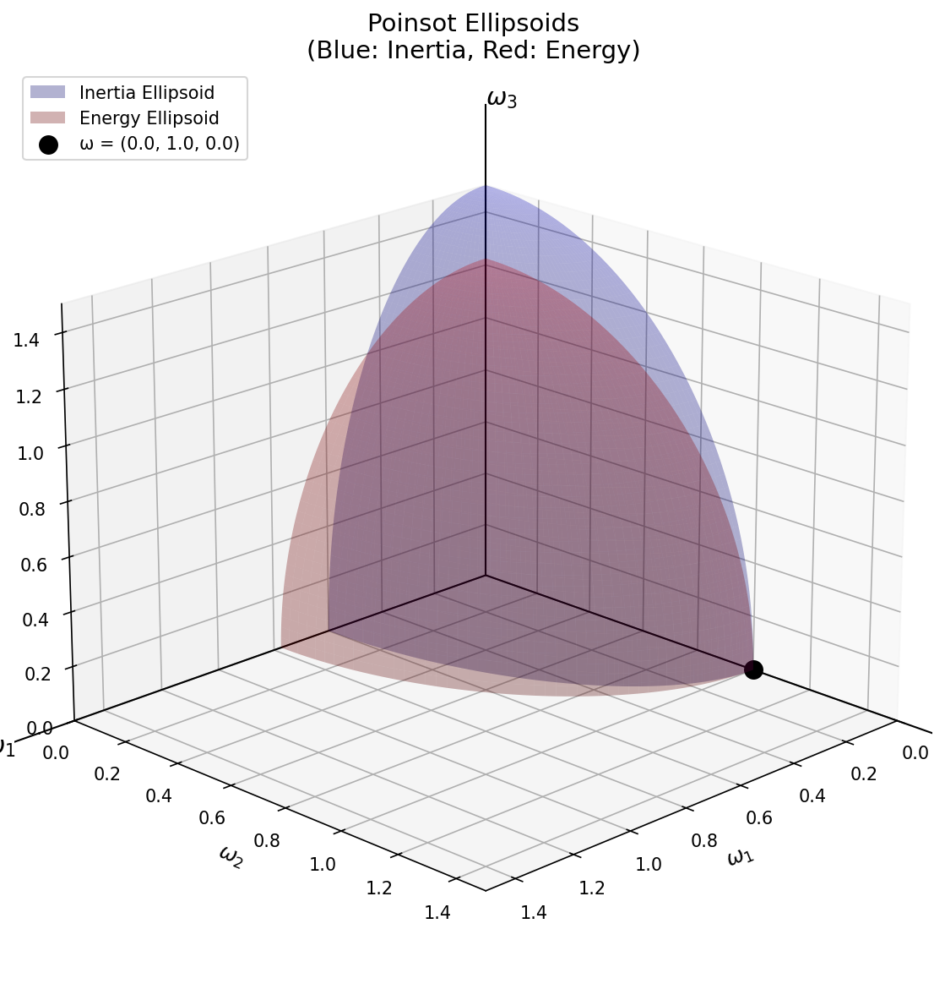

# Poinsot Ellipsoid Visualization

A Python visualization tool for Poinsot ellipsoids, which describe the geometry of rigid body rotation in classical mechanics.

## Overview

This script visualizes the Poinsot construction, a geometric representation of the rotational motion of a rigid body. It plots two key ellipsoids:

- **Inertia Ellipsoid** (blue): Represents the constraint from conservation of angular momentum
- **Energy Ellipsoid** (red): Represents the constraint from conservation of kinetic energy

The intersection of these two ellipsoids forms the polhode, the curve traced by the angular velocity vector in the body frame.



## Physics Background

For a rotating rigid body with moments of inertia I₁, I₂, I₃ and angular velocity components ω₁, ω₂, ω₃:

- **Angular momentum squared** (conserved): L² = (I₁ω₁)² + (I₂ω₂)² + (I₃ω₃)²
- **Rotational kinetic energy** (conserved): T = ½(I₁ω₁² + I₂ω₂² + I₃ω₃²)

These conservation laws define two ellipsoidal surfaces in angular velocity space. The angular velocity vector must lie on both surfaces simultaneously, constraining its motion to the intersection curve (polhode).

## Requirements

- Python 3.x
- NumPy
- Matplotlib

Install dependencies:
```bash
pip install numpy matplotlib
```

## Usage

### Basic usage (default configuration)
```bash
python poinsot_ellipsoid.py
```
Default: ω = (0, 1, 0)

### Specify custom angular velocity components
```bash
python poinsot_ellipsoid.py --omega1 0.5 --omega2 0.8 --omega3 0.3
```

### Specify individual components
```bash
python poinsot_ellipsoid.py --omega2 1.0
python poinsot_ellipsoid.py --omega1 0.5 --omega3 0.3
```

Unspecified components default to 0.

## Output

The script generates:
- An interactive 3D visualization window
- A saved PNG image: `poinsot_ellipsoids.png`
- Console output with calculated values:
  - Moments of inertia
  - Angular velocity components
  - Angular momentum squared (L²)
  - Rotational kinetic energy (T)

## Configuration

The moments of inertia are hardcoded in the script (poinsot_ellipsoid.py:24):
```python
I1, I2, I3 = 5.0, 3.0, 2.0  # Assumes I1 > I2 > I3
```

Modify these values to explore different rigid body configurations.

## Visualization Details

The plot shows:
- Blue semi-ellipsoid: Inertia ellipsoid surface
- Red semi-ellipsoid: Energy ellipsoid surface
- Green dashed curve: Approximate intersection (polhode)
- Black point: Given angular velocity vector ω
- Coordinate axes: ω₁, ω₂, ω₃

Only the positive octant is displayed for clarity.

## Example

```bash
python poinsot_ellipsoid.py --omega1 0.2 --omega2 0.8 --omega3 0.1
```

Output:
```
Moments of inertia: I1=5.0, I2=3.0, I3=2.0
Angular velocity: ω=(0.2, 0.8, 0.1)
Angular momentum squared: L²=6.770
Rotational kinetic energy: T=1.030
```

## Development

### Running Tests

The project includes a comprehensive test suite with unit tests and integration tests.

#### Install Development Dependencies

```bash
pip install -r requirements-dev.txt
```

#### Run All Tests

```bash
pytest test_poinsot_ellipsoid.py -v
```

#### Run Tests with Coverage

```bash
pytest test_poinsot_ellipsoid.py --cov=poinsot_ellipsoid --cov-report=term-missing
```

#### Run Specific Test Classes

```bash
# Test argument parsing
pytest test_poinsot_ellipsoid.py::TestArgumentParsing -v

# Test physics calculations
pytest test_poinsot_ellipsoid.py::TestConservedQuantities -v

# Test visualization
pytest test_poinsot_ellipsoid.py::TestVisualization -v
```

### Continuous Integration

The project uses GitHub Actions for automated testing on every commit. The CI pipeline:

- Tests on Python 3.8, 3.9, 3.10, 3.11, and 3.12
- Tests on Ubuntu, macOS, and Windows
- Runs comprehensive unit tests with pytest
- Generates code coverage reports
- Performs integration tests by running the script with various inputs
- Includes optional code quality checks (black, isort, pylint, mypy)

CI status: 

### Test Coverage

The test suite covers:

- **Argument parsing**: Default values, single components, all components, edge cases
- **Physics calculations**: Conserved quantities for various angular velocities and inertia values
- **Ellipsoid parameters**: Semi-axes calculations, ordering, edge cases
- **Surface generation**: Mesh generation, geometric properties, ellipsoid equation satisfaction
- **Intersection finding**: Polhode curve approximation with various tolerances
- **Visualization**: File creation, correct outputs, various input configurations
- **Edge cases**: Zero values, very small/large values, equal/symmetric inertias
- **Physics consistency**: Energy positivity, angular momentum properties, ellipsoid intersections
